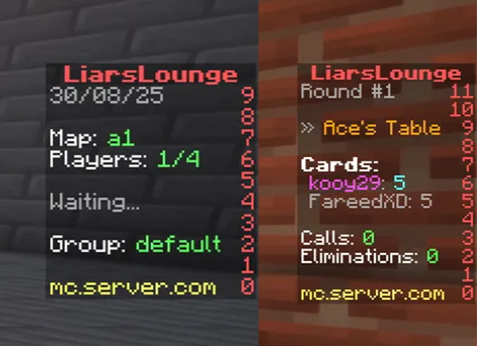
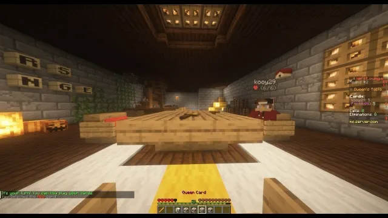
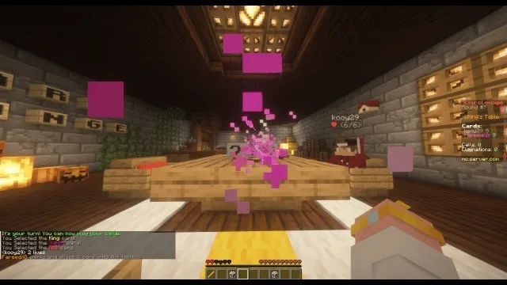

# LiarsLounge

[](https://adoptium.net/)
[](LICENSE)
[](https://gradle.org/)
[](https://papermc.io/)
[](https://discord.gg/rsYRdv8hJM)

> An open-source Minecraft plugin that recreates the bluffing, deception, and survival mechanics of [Liars Bar](https://store.steampowered.com/app/3097560/Liar_s_Bar/) as a fully playable multiplayer minigame.

Originally developed as a commercial plugin and later released as open source under GPLv3.


---

## Requirements

| Requirement | Details |
|---|---|
| Java | 11 or higher |
| Server | [Spigot](https://spigotmc.org), [Paper](https://papermc.io), or any NMS-compatible fork |
| Minecraft | 1.8.8 or 1.21.11 |
| Database | SQLite _(default)_ or MySQL |

> Forks without NMS access are not supported.

---

## Features

### » 🃏 Gameplay
- Bluff, deceive, and accuse other players at the table
- Card-based turn system with dynamic table state
- Axe execution mechanic with configurable survival chances
- Multi-round sessions. last player standing wins!

### » 🏟️ Server
- Multi-arena support for concurrent matches
- Real-time scoreboards and persistent player stats
- Inventory GUI, Book UI, holograms, and title-based feedback
- Fully configurable messages, game items, and interfaces
- SQLite (single-server) and MySQL (network) storage backends
- [PlaceholderAPI](https://github.com/PlaceholderAPI/PlaceholderAPI) integration

### » ✨ Visual Systems
- Card throw, card flip, and axe strike animations
- All effects implemented at the packet level, client-side and server-independent

---

## Media/Screenshots
<details>
<summary>View Screenshots</summary>
<br>

[Gameplay Video](https://youtu.be/hyt7v-J6-3M)

**SCOREBOARD**



**TABLE CARD**


**CARD THROW**



**GAME OVER**



**EXTRAS**

- Players/Spectators never see what cards others are holding, instead they see a placeholder card


- Each player see the cards facing towards them (Client-Side Magic)


- Remaining lives can be easily seen above a player


</details>

---

## Architecture

LiarsLounge uses a **multi-module Gradle** structure. Core gameplay logic is version-agnostic; NMS and packet work is isolated in per-version modules.

```
api/          Public API surface
main/         Shared game logic
v1_8_R3/      Minecraft 1.8.8 NMS implementation
v1_21_R7/     Minecraft 1.21.11 NMS implementation
paper_*/      Paper-specific integrations
```

### ⬡ Version Compatibility

Minecraft versions differ substantially in NMS internals and packet structures. Version-specific modules isolate these concerns so the shared game logic never touches version-dependent APIs.

### ⬡ Packet-Based Visuals

Animations (card throw, card flip, axe strike) are implemented via direct packet communication rather than server-side entities, giving smooth client-side effects with minimal server overhead.

### ⬡ Asynchronous Processing

The following systems run off the main thread to reduce tick impact:

- Database reads/writes
- Animation scheduling
- Scoreboard updates
- Packet preparation and dispatch

### ⬡ Dependencies

| Library | Purpose |
|---|---|
| [FastBoard](https://github.com/MrMicky-FR/FastBoard) | Scoreboard API, flicker-free scoreboard updates |
| [BookAPI](https://github.com/meteormc/bookapi) | Book and Quill UI for in-game interfaces |
| [Libby](https://github.com/byteflux/libby) | Runtime library loader, downloads deps on startup |
| [bStats](https://bstats.org/) | Anonymous plugin usage metrics |
| [HikariCP](https://github.com/brettwooldridge/HikariCP) | High-performance JDBC connection pooling |

### ⬡ Building

**Requirements:** Java 21+, Gradle

```bash
git clone https://github.com/aarcorrea/LiarsLounge.git
cd LiarsLounge
./gradlew shadowJar
```

---

## Contributing

Bug reports, pull requests, and suggestions are welcome.  
Please open an issue before submitting large changes.

---

## Credits

LiarsLounge was inspired by ideas, patterns, and educational resources from the Minecraft open-source ecosystem.

- [PacketEvents](https://github.com/retrooper/packetevents) — packet abstraction reference
- [BedWars1058](https://github.com/andrei1058/BedWars1058)/[BedWars2023](https://github.com/tomkeuper/BedWars2023) — arena system, NMS implementation, packet handling
- The wider Spigot, Paper, and Bukkit communities

---

## License

Licensed under the [GNU General Public License v3.0](LICENSE).
